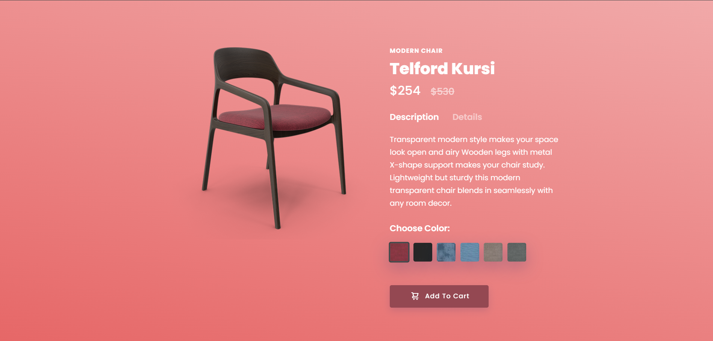

# Modern-Chair

I have created a modern chair using advance css and html. It gives me basic understanding of using advanced css and how to design a website from a scratch .in this project you can able to change colour of chair using a radio buttons and changes appear on entire site . It basically a interactive website. I would like to thank Code help and Love Babbar for explaning this project so well so that i able to make it.

<a href="https://harshsinghraajput.github.io/Modern-Recliner-Selling-Page/" target="_blank">Click Here for Have a First Glance of the Website</a>

